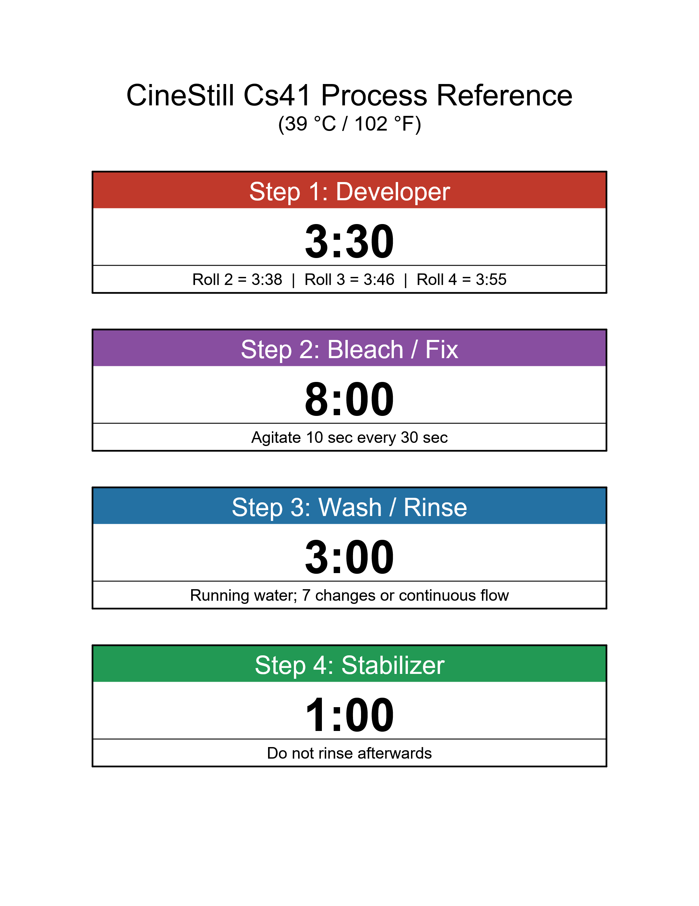

# CineStill CS41 Development Times Reference Poster

This poster provides an easy-to-read, large-format reference for the popular **CineStill CS41 C-41 color negative film developing kit**. 

It lists the times and notes for each processing step, formatted for quick use while working in the darkroom. I got tired of having to pick up the instructions to double-check the tiny print all the time, so I made this alternative!

You may download a PNG or PDF version here, or run the code yourself if you want to make some tweaks.

If you'd like to include push/pull processing times, there's an additional line for step 1 which can be uncommented if desired. (Maybe I'll generate and upload that variation as well the next time I dust this off. Or just submit an issue and I'll do it asap.)

## Preview

**[Download PDF Version](CineStill_CS41_Processing_Times_Chart.pdf)**

## Generating the Poster Yourself

If you make any code changes, simply run the generate_chart script to regenerate the PDF and output it to the program's directory. It depends on the `reportlab` package, which you'll probably need to install with uv/pip/pipx.